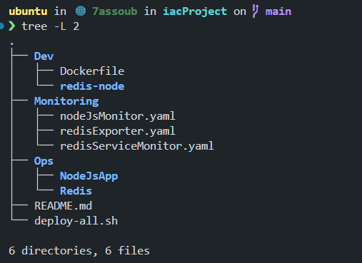

# TME1CRV - Automated Kubernetes Architecture

This project demonstrates an end-to-end automated architecture deployed on Kubernetes. All deployments and configurations are automated through provided scripts, so you don't have to worry about the manual steps. Below is an overview of the architecture and how each component interacts.

## Prerequisites

- Kubernetes cluster (e.g., Minikube, kind, or a cloud provider)
- `kubectl` CLI
- [Helm 3](https://helm.sh/docs/intro/install/)
- Docker (to build the Node.js image)

---

## Setup & Deployment Steps

## Directory Structure

---

### 1. Deploy the infrastructure

The deployment phase is automated using a bash script, all you need is to run `./deploy-all.sh`. (Make sure to chmod u+x the script)

## Architecture Overview

The system is composed of three major components:

1. **Redis Cluster (Master/Replica)**
2. **Node.js Web Application**
3. **Monitoring Stack (Prometheus, Grafana, and Redis Exporter)**

These components work together to deliver a scalable, high-performance application with robust monitoring capabilities.

## Redis Cluster

- **Master/Replica Pattern:**  
  The Redis cluster is configured in a master/replica pattern. The **Redis Master** handles all write operations, ensuring data consistency. The **Redis Replicas** are set up to replicate the master’s data asynchronously and are used to handle read operations. This separation allows the system to scale out read workloads without compromising write performance.

- **Service Discovery:**  
  A Kubernetes Service is used to expose the Redis Master, making it accessible to the Node.js application. The replicas are similarly exposed via a Service, ensuring that read requests are automatically balanced across them.

## Node.js Web Application

- **Dual Redis Clients:**  
  The Node.js app leverages two Redis clients. One connects to the Redis Master for all write operations, while the other connects to the Redis Replicas for read operations. This dual setup maximizes performance by directing writes and reads to the appropriate instances.

- **Metrics Endpoint:**  
  The application is instrumented with [express-prometheus-middleware](https://github.com/jochen-schweizer/express-prometheus-middleware). It exposes a `/metrics` endpoint that collects and presents various performance metrics such as HTTP request durations, request counts, CPU usage, memory usage, event loop lag, and more. These metrics are crucial for monitoring and diagnosing application performance.

## Monitoring Stack

- **Prometheus & Grafana via Helm:**  
  The monitoring stack is deployed using the [kube-prometheus-stack](https://github.com/prometheus-operator/kube-prometheus-stack) Helm chart. This bundle includes Prometheus, Alertmanager, and Grafana.  
  - **Prometheus** scrapes metrics from the Node.js application (via its `/metrics` endpoint) and from the Redis Exporter.
  - **Grafana** provides interactive dashboards to visualize these metrics in real time.
  
- **Redis Exporter:**  
  Since Redis does not expose Prometheus metrics natively, a Redis Exporter (using a Docker image like [oliver006/redis_exporter](https://hub.docker.com/r/oliver006/redis_exporter)) is deployed. This exporter connects to Redis, gathers key performance metrics (e.g., memory usage, command throughput, replication status), and exposes them in a Prometheus-friendly format.

- **ServiceMonitors:**  
  To integrate the custom metrics into the Prometheus stack, ServiceMonitor resources (automatically discovered by the Prometheus Operator) are configured. These ServiceMonitors, deployed in the default namespace, are set to monitor endpoints in the `iacproject` namespace (where the Node.js app and Redis Exporter reside). They ensure that Prometheus scrapes the correct metrics without any manual configuration.

## How It All Works

- **Automated Deployment:**  
  Every component (Redis cluster, Node.js app, and Monitoring stack) is deployed automatically using scripts provided in this repository. Once executed, these scripts configure the entire environment—there’s no need to manually deploy or configure individual components.

- **Component Interactions:**  
  1. **Data Flow:**  
     - The Node.js app writes to Redis via the master and reads from Redis via the replicas.
     - Data replication from master to replicas is handled asynchronously by Redis, ensuring that reads are always served by the replicas.
  2. **Metrics Collection:**  
     - The Node.js app exposes performance metrics on `/metrics`.
     - The Redis Exporter gathers and exposes metrics from the Redis cluster.
     - Prometheus, deployed via Helm, automatically scrapes these endpoints using ServiceMonitors, collecting data from both the application and Redis.
  3. **Visualization & Alerts:**  
     - Grafana, part of the Prometheus stack, visualizes the collected metrics.
     - Pre-configured dashboards and alert rules help in monitoring the health and performance of the entire system.

## Final Notes

All aspects of this architecture—from the Redis cluster setup and Node.js application to the monitoring stack—are fully automated. By simply running the provided scripts, you can have an entire, production-ready environment deployed on Kubernetes. This architecture is designed to scale, ensuring that write operations remain consistent while read operations can be scaled horizontally, and detailed monitoring provides full visibility into system performance.

Happy monitoring and enjoy the seamless automation!
